# THED-PV: A High-Resolution Multi-Perspective Thermal Imaging Dataset for Photovoltaic Homography Estimation

[](https://doi.org/10.5281/zenodo.17404247)
[](https://www.python.org/downloads/)
[](https://creativecommons.org/licenses/by/4.0/)
[](https://github.com/psf/black)

<p align="center">
  
  
  
</p>

---

## 📋 Table of Contents

- [Overview](#-overview)
- [Dataset Highlights](#-dataset-highlights)
- [Repository Structure](#-repository-structure)
- [Installation](#-installation)
- [Quick Start](#-quick-start)
- [Pipeline Workflow](#-pipeline-workflow)
- [Scripts Documentation](#-scripts-documentation)
- [Data Organization](#-data-organization)
- [Usage Examples](#-usage-examples)
- [Technical Validation](#-technical-validation)
- [Citation](#-citation)
- [License](#-license)
- [Contact](#-contact)

---

## 🔬 Overview

**THED-PV** (Thermal Homography Estimation Dataset for Photovoltaics) is a high-resolution thermal imaging dataset comprising **12,460 raw thermal images** of photovoltaic (PV) panels captured under diverse and controlled conditions. This dataset is specifically designed to advance deep learning models for thermal homography estimation in solar energy systems and close-range robotic inspection scenarios.

### Key Contributions

- ✅ **High Resolution**: 640×512 pixel thermal images (14-bit TIFF format)
- ✅ **Multi-Perspective Capture**: 4 heights (10, 20, 30, 40cm) × 2 angles (30°, 60°)
- ✅ **Temporal Variation**: 4 daily capture times (8 AM, 10 AM, 12 PM, 2 PM)
- ✅ **Environmental Diversity**: 5 cleanliness levels (clean → progressively soiled over 5 days)
- ✅ **Homography-Ready**: Synthetic pair generation for 99,680+ training pairs
- ✅ **Artifact Suppression**: Complete preprocessing pipeline for glare, shadow, and noise removal
- ✅ **Rich Metadata**: Comprehensive environmental measurements (irradiance, temperature, humidity, wind, soiling)
- ✅ **Production Code**: Complete preprocessing, generation, and validation scripts

---

## ✨ Dataset Highlights

| Metric | Value |
|--------|-------|
| **Raw Images** | 12,460 |
| **Resolution** | 640×512 pixels |
| **Bit Depth** | 14-bit TIFF |
| **Preprocessed Patches** | 49,840 (320×256) |
| **Homography Pairs** | 99,680+ (synthetic) |
| **Collection Period** | 5 days (December 20-24, 2024) |
| **Capture Location** | Qatar Environment & Energy Research Institute (QEERI-OTF) |
| **Total Raw Data Size** | ~26.6 GB |
| **Preprocessed Data Size** | ~4 GB |

### Capture Conditions

- **Heights**: 10cm, 20cm, 30cm, 40cm above PV panel surface
- **Angles**: 30° and 60° from vertical
- **Times**: 08:00, 10:00, 12:00, 14:00 (local time)
- **Progressive Soiling**: Clean (Day 1) → Heavily Soiled (Day 5)
- **Environmental Monitoring**: 1-minute resolution sensor data
  - Peak irradiance: 652-876 W/m²
  - Temperature range: 16.9-21.8°C
  - Humidity: 27-62%
  - Wind speed: 1.1-3.3 m/s
  - Soiling progression: 18.9% → 20.4%

---

## 📁 Repository Structure

```
THED-PV/
├── 📂 configs/                        # Configuration files
│   └── preprocessing_config.yaml     # Preprocessing parameters
│
├── 📂 data/                          # Data directory (download separately)
│   ├── download_instructions.md      # Comprehensive download guide
│   ├── README.md                     # Data organization details
│   ├── raw/                          # Original 14-bit TIFF images (~26.6 GB)
│   ├── preprocessed/                 # 320×256 patches (~4 GB)
│   ├── homography_pairs/             # Training-ready pairs (generate on-demand)
│   ├── environmental_metadata/       # CSV files with sensor data
│   └── splits/                       # Train/val/test partitions
│
├── 📂 docs/                          # Documentation
│   ├── API_REFERENCE.md              # Detailed API documentation
│   ├── DATASET_STRUCTURE.md          # Complete dataset organization
│   └── TROUBLESHOOTING.md            # Common issues and solutions
│
├── 📂 scripts/                       # Utility scripts
│   ├── download_data.py              # Dataset downloader from Zenodo
│   ├── evaluate_features.py          # Feature matching evaluation
│   ├── match_metadata.py             # Temporal metadata alignment
│   ├── verify_dataset.py             # Data integrity verification
│   └── visualize_pairs.py            # Diagnostic visualizations
│
├── 📂 src/                           # Core source code
│   ├── __init__.py                   # Package initialization
│   ├── preprocess.py                 # Preprocessing pipeline
│   ├── generate_homography_pairs.py  # Synthetic pair generation
│   ├── split_dataset.py              # Dataset partitioning
│   ├── utils.py                      # Helper functions
│   └── validators.py                 # Data validation utilities
│
├── 📄 .gitignore                     # Git ignore rules
├── 📄 CHANGELOG.md                   # Version history
├── 📄 LICENSE                        # CC BY 4.0 License
├── 📄 QUICK_START.md                 # Quick start guide
├── 📄 README.md                      # This file
├── 📄 requirements.txt               # Python dependencies
└── 📄 setup.py                       # Package installation script
```

---

## 🛠️ Installation

### Prerequisites

- Python 3.8 or higher
- pip or conda package manager
- 40+ GB free disk space (for full dataset)

### Step 1: Clone the Repository

```bash
git clone https://github.com/YaqoobAnsari/THED-PV.git
cd THED-PV
```

### Step 2: Create Virtual Environment (Recommended)

```bash
# Using venv
python -m venv venv
source venv/bin/activate  # On Windows: venv\Scripts\activate

# Using conda
conda create -n thedpv python=3.8
conda activate thedpv
```

### Step 3: Install Dependencies

```bash
pip install -r requirements.txt

# Or install in editable mode for development
pip install -e .
```

### Dependencies

The project requires the following Python packages:

```
opencv-python>=4.5.0
numpy>=1.21.0
pandas>=1.3.0
scipy>=1.7.0
matplotlib>=3.4.0
Pillow>=8.3.0
PyYAML>=5.4.0
tqdm>=4.64.0
requests>=2.28.0
```

---

## 🚀 Quick Start

### Download the Dataset

```bash
# Download all data (~26.6 GB)
python scripts/download_data.py --output ./data --type all

# Or download specific components
python scripts/download_data.py --output ./data --type raw           # Raw images only
python scripts/download_data.py --output ./data --type preprocessed  # Preprocessed only
python scripts/download_data.py --output ./data --type metadata      # Metadata only
```

For detailed download instructions, see [`data/download_instructions.md`](data/download_instructions.md).

### Run the Complete Pipeline

```bash
# 1. Preprocess raw thermal images
python src/preprocess.py \
  --input_dir ./data/raw \
  --output_dir ./data/preprocessed \
  --config configs/preprocessing_config.yaml

# 2. Generate synthetic homography pairs
python src/generate_homography_pairs.py \
  --input_dir ./data/preprocessed \
  --output_dir ./data/homography_pairs \
  --num_pairs 2 \
  --perturbation_range 15 50 \
  --overlap_range 0.55 0.85

# 3. Match images with environmental metadata
python scripts/match_metadata.py \
  --image_dir ./data/preprocessed \
  --metadata_dir ./data/environmental_metadata \
  --output ./data/matched_metadata.csv

# 4. Split dataset into train/val/test
python src/split_dataset.py \
  --input_dir ./data/homography_pairs \
  --output_dir ./data/splits \
  --train_ratio 0.5 \
  --val_ratio 0.25 \
  --test_ratio 0.25 \
  --seed 42

# 5. Evaluate classical feature matching methods
python scripts/evaluate_features.py \
  --dataset_dir ./data/splits/test \
  --detector ORB \
  --output ./results/orb_evaluation.csv

# 6. Create diagnostic visualizations
python scripts/visualize_pairs.py \
  --dataset_dir ./data/splits/test \
  --output_dir ./visualizations \
  --max_pairs 20 \
  --detector ORB
```

---

## 🔄 Pipeline Workflow

```mermaid
graph TD
    A[Raw Thermal Images<br/>640×512, 14-bit TIFF] --> B[Preprocessing Pipeline]
    B --> C[Preprocessed Patches<br/>320×256, 8-bit]
    C --> D[Homography Pair Generation]
    D --> E[Synthetic Training Pairs<br/>99,680+ pairs]
    E --> F[Dataset Splitting]
    F --> G[Train 50%]
    F --> H[Val 25%]
    F --> I[Test 25%]
    
    J[Environmental Metadata<br/>1-min resolution] --> K[Temporal Alignment]
    C --> K
    K --> L[Matched Image-Metadata Pairs]
    
    G --> M[Deep Learning Training]
    H --> M
    I --> N[Evaluation & Validation]
    
    style A fill:#ff6b6b
    style C fill:#4ecdc4
    style E fill:#95e1d3
    style L fill:#f9ca24
```



### Pipeline Stages

1. **Preprocessing** (`src/preprocess.py`)
   - CLAHE contrast enhancement (clip: 0.018, tile: 8×8)
   - Bilateral filtering (σ_spatial=8, σ_color=0.015)
   - Adaptive glare suppression (threshold: mean + 2σ)
   - Shadow correction via histogram normalization
   - Image sharpening
   - Quarter into four 320×256 patches

2. **Homography Pair Generation** (`src/generate_homography_pairs.py`)
   - Random 256×256 patch selection with Gaussian center bias
   - Geometric perturbation (15-50 pixel corner displacement)
   - Spatial translation (55-85% overlap ratio)
   - Ground truth homography computation via DLT
   - Automatic validation and boundary checking

3. **Metadata Matching** (`scripts/match_metadata.py`)
   - Timestamp extraction from image filenames
   - Temporal alignment with environmental data (1-min resolution)
   - Multiple interpolation strategies (nearest/linear/forward/backward)
   - Configurable time tolerance

4. **Dataset Splitting** (`src/split_dataset.py`)
   - Stratified partitioning (50% train, 25% val, 25% test)
   - Balanced across cleanliness levels and capture times
   - Reproducible with fixed random seed

5. **Feature Evaluation** (`scripts/evaluate_features.py`)
   - Classical methods: ORB, SIFT, AKAZE, BRISK, KAZE
   - Metrics: keypoint counts, inlier ratios, reprojection errors
   - Batch processing with statistical summaries

6. **Visualization** (`scripts/visualize_pairs.py`)
   - Side-by-side image comparison
   - Keypoint detection overlay
   - Feature correspondence lines (inliers/outliers)
   - Homography warping with difference maps
   - Grid overlay for geometric distortion

---

## 📚 Scripts Documentation

### Core Processing Scripts (`src/`)

#### `preprocess.py`
Applies the complete preprocessing pipeline to raw thermal images.

```bash
python src/preprocess.py \
  --input_dir ./data/raw \
  --output_dir ./data/preprocessed \
  --config configs/preprocessing_config.yaml
```

**Key Parameters:**
- `--input_dir`: Directory containing raw thermal images
- `--output_dir`: Directory to save preprocessed patches
- `--config`: YAML configuration file with preprocessing parameters

**Processing Steps:**
1. CLAHE contrast enhancement
2. Bilateral filtering for noise reduction
3. Glare and shadow suppression
4. Image sharpening
5. Quartering into 320×256 patches

---

#### `generate_homography_pairs.py`
Generates synthetic homography pairs from preprocessed images.

```bash
python src/generate_homography_pairs.py \
  --input_dir ./data/preprocessed \
  --output_dir ./data/homography_pairs \
  --num_pairs 2 \
  --perturbation_range 15 50 \
  --overlap_range 0.55 0.85
```

**Key Parameters:**
- `--num_pairs`: Number of pairs to generate per source image (default: 2)
- `--perturbation_range`: Min and max corner displacement in pixels
- `--overlap_range`: Min and max overlap ratio between pairs
- `--seed`: Random seed for reproducibility

**Outputs:**
- `patch_A.tiff`: Source patch (256×256)
- `patch_B.tiff`: Warped patch (256×256)
- `H_matrix.npy`: Ground truth homography matrix (3×3)
- `metadata.txt`: Generation parameters

---

#### `split_dataset.py`
Creates stratified train/validation/test splits.

```bash
python src/split_dataset.py \
  --input_dir ./data/homography_pairs \
  --output_dir ./data/splits \
  --train_ratio 0.5 \
  --val_ratio 0.25 \
  --test_ratio 0.25 \
  --seed 42
```

**Key Parameters:**
- `--train_ratio`: Proportion for training set (default: 0.5)
- `--val_ratio`: Proportion for validation set (default: 0.25)
- `--test_ratio`: Proportion for test set (default: 0.25)
- `--seed`: Random seed for reproducibility

---

### Utility Scripts (`scripts/`)

#### `download_data.py`
Downloads the THED-PV dataset from Zenodo.

```bash
# Download all files
python scripts/download_data.py --output ./data --type all

# Download specific components
python scripts/download_data.py --output ./data --type raw
python scripts/download_data.py --output ./data --type preprocessed
python scripts/download_data.py --output ./data --type metadata
```

**Features:**
- Progress tracking with detailed progress bars
- Automatic MD5 checksum verification
- Resume capability for interrupted downloads
- Selective download by file type

---

#### `match_metadata.py`
Automatically aligns thermal images with environmental measurements.

```bash
# Match entire directory
python scripts/match_metadata.py \
  --image_dir ./data/preprocessed \
  --metadata_dir ./data/environmental_metadata \
  --output matched_data.csv

# Match single image
python scripts/match_metadata.py \
  --image_path ./data/raw/.../thermal_20241220_080023_frame001.tiff \
  --metadata_dir ./data/environmental_metadata
```

**Key Parameters:**
- `--tolerance`: Time tolerance for matching in seconds (default: 60)
- `--interpolation`: Method for temporal alignment (nearest/linear/forward/backward)
- `--recursive`: Search recursively in subdirectories

**Output Columns:**
- Image path and timestamp
- Matched environmental timestamp
- Time difference (seconds)
- POA irradiance, temperature, humidity, wind speed, soiling ratio

---

#### `evaluate_features.py`
Evaluates feature detection and matching for classical methods.

```bash
# Evaluate single detector
python scripts/evaluate_features.py \
  --dataset_dir ./data/splits/test \
  --detector ORB \
  --output results_orb.csv

# Compare multiple detectors
python scripts/evaluate_features.py \
  --image1 ./data/pairs/sample_001/patch_A.tiff \
  --image2 ./data/pairs/sample_001/patch_B.tiff \
  --compare
```

**Supported Detectors:**
- ORB (Oriented FAST and Rotated BRIEF)
- SIFT (Scale-Invariant Feature Transform)
- AKAZE (Accelerated-KAZE)
- BRISK (Binary Robust Invariant Scalable Keypoints)
- KAZE

**Metrics Calculated:**
- Keypoint counts
- Number of matches and inliers
- Inlier ratio
- Reprojection errors (mean, median, std, max, RMSE)
- Homography estimation success rate

---

#### `visualize_pairs.py`
Generates diagnostic visualizations for homography pairs.

```bash
# Visualize single pair
python scripts/visualize_pairs.py \
  --pair_dir ./data/homography_pairs/sample_00001 \
  --output_dir ./visualizations \
  --detector ORB

# Batch visualize multiple pairs
python scripts/visualize_pairs.py \
  --dataset_dir ./data/homography_pairs \
  --output_dir ./visualizations \
  --max_pairs 20
```

**Visualization Types:**
1. Side-by-side image comparison
2. Keypoint detection overlay
3. Feature correspondence (inliers in green, outliers in red)
4. Homography warping with difference map
5. Grid overlay showing geometric distortion

**Output Files:**
- `{pair_name}_side_by_side.png`
- `{pair_name}_keypoints.png`
- `{pair_name}_matches.png`
- `{pair_name}_warp.png`
- `{pair_name}_grid.png`

---

## 💾 Data Organization

### Raw Data Structure

```
data/raw/
├── 2024-12-20/          # Day 1 (Clean)
├── 2024-12-21/          # Day 2 (Soiled 1)
├── 2024-12-22/          # Day 3 (Soiled 2)
├── 2024-12-23/          # Day 4 (Soiled 3)
└── 2024-12-24/          # Day 5 (Soiled 4)
    ├── 08h00_30deg/     # 8 AM, 30° angle
    ├── 10h00_60deg/     # 10 AM, 60° angle
    ├── 12h00_30deg/     # 12 PM, 30° angle
    └── 14h00_60deg/     # 2 PM, 60° angle
        ├── 10cm/        # 10cm height
        ├── 20cm/        # 20cm height
        ├── 30cm/        # 30cm height
        └── 40cm/        # 40cm height
            └── thermal_YYYYMMDD_HHMMSS_frameXXX.tiff
```

### Preprocessed Data Structure

Mirrors the raw structure but with four 320×256 patches per original image:
- `thermal_YYYYMMDD_HHMMSS_frameXXX_patch0.tiff`
- `thermal_YYYYMMDD_HHMMSS_frameXXX_patch1.tiff`
- `thermal_YYYYMMDD_HHMMSS_frameXXX_patch2.tiff`
- `thermal_YYYYMMDD_HHMMSS_frameXXX_patch3.tiff`

### Homography Pairs Structure

```
data/homography_pairs/
└── sample_XXXXX/
    ├── patch_A.tiff      # Source patch (256×256)
    ├── patch_B.tiff      # Warped patch (256×256)
    ├── H_matrix.npy      # Ground truth homography (3×3)
    └── metadata.txt      # Generation parameters
```

### Environmental Metadata

```
data/environmental_metadata/
├── environmental_day1.csv  # December 20, 2024
├── environmental_day2.csv  # December 21, 2024
├── environmental_day3.csv  # December 22, 2024
├── environmental_day4.csv  # December 23, 2024
└── environmental_day5.csv  # December 24, 2024
```

**Metadata Columns:**
- Timestamp (1-minute resolution)
- Plane-of-Array Irradiance (W/m²)
- POA Short-Circuit Current (A)
- Global Horizontal Irradiance (W/m²)
- Direct Normal Irradiance (W/m²)
- Surface Albedo
- Wind Speed & Direction (m/s, degrees)
- Soiling Ratio (%)
- Ambient Temperature (°C)
- Relative Humidity (%)
- UV-A & UV-B Radiation (W/m²)

---

## 💡 Usage Examples

### Example 1: Loading and Visualizing a Thermal Image

```python
import cv2
import matplotlib.pyplot as plt

# Load 14-bit TIFF image
image = cv2.imread('data/raw/2024-12-20/08h00_30deg/10cm/thermal_20241220_080023_frame001.tiff', 
                   cv2.IMREAD_UNCHANGED)

# Normalize for display
image_normalized = cv2.normalize(image, None, 0, 255, cv2.NORM_MINMAX)
image_8bit = image_normalized.astype('uint8')

# Display
plt.imshow(image_8bit, cmap='hot')
plt.colorbar()
plt.title('Raw Thermal Image')
plt.show()
```

### Example 2: Loading Homography Pair for Training

```python
import numpy as np
from torch.utils.data import Dataset

class HomographyDataset(Dataset):
    def __init__(self, pair_dir):
        self.pair_dir = Path(pair_dir)
        self.samples = list(self.pair_dir.glob('sample_*'))
    
    def __len__(self):
        return len(self.samples)
    
    def __getitem__(self, idx):
        sample_dir = self.samples[idx]
        
        # Load images
        patch_a = cv2.imread(str(sample_dir / 'patch_A.tiff'), cv2.IMREAD_GRAYSCALE)
        patch_b = cv2.imread(str(sample_dir / 'patch_B.tiff'), cv2.IMREAD_GRAYSCALE)
        
        # Load ground truth homography
        H_gt = np.load(sample_dir / 'H_matrix.npy')
        
        # Convert to tensors (example)
        patch_a = torch.from_numpy(patch_a).float() / 255.0
        patch_b = torch.from_numpy(patch_b).float() / 255.0
        H_gt = torch.from_numpy(H_gt).float()
        
        return patch_a, patch_b, H_gt

# Usage
dataset = HomographyDataset('data/splits/train')
dataloader = torch.utils.data.DataLoader(dataset, batch_size=32, shuffle=True)
```

### Example 3: Accessing Environmental Metadata

```python
import pandas as pd
from datetime import datetime

# Load metadata
metadata = pd.read_csv('data/environmental_metadata/environmental_day1.csv')
metadata['timestamp'] = pd.to_datetime(metadata['timestamp'])

# Filter by time range
morning_data = metadata[
    (metadata['timestamp'] >= datetime(2024, 12, 20, 8, 0)) &
    (metadata['timestamp'] <= datetime(2024, 12, 20, 10, 0))
]

# Calculate statistics
print(f"Mean irradiance: {morning_data['poa_irradiance'].mean():.2f} W/m²")
print(f"Mean temperature: {morning_data['ambient_temp'].mean():.2f} °C")
print(f"Soiling ratio: {morning_data['soiling_ratio'].mean():.2f}%")
```

### Example 4: Evaluating a Custom Homography Model

```python
from scripts.evaluate_features import FeatureEvaluator

# Initialize evaluator
evaluator = FeatureEvaluator(detector_type='ORB')

# Evaluate on test set
results_df = evaluator.evaluate_dataset(
    dataset_dir='./data/splits/test',
    output_csv='./results/my_model_evaluation.csv'
)

# Print summary statistics
print(f"Mean inlier ratio: {results_df['inlier_ratio'].mean():.3f}")
print(f"Mean RMSE: {results_df['rmse'].mean():.2f} pixels")
```

---

## 📊 Technical Validation

### Preprocessing Validation Metrics

| Metric | Raw Images | Preprocessed | Improvement |
|--------|-----------|--------------|-------------|
| **PSNR (dB)** | 27.3-31.5 | Artifact-free | Glare/shadow removed |
| **SSIM** | - | 0.83-0.94 | Structure preserved |
| **ORB Keypoints** | 10-154 | 395-1545 | **10-15× increase** |
| **SIFT Keypoints** | 14-154 | 150-823 | **5-10× increase** |
| **Entropy** | 16.75-17.31 | 17.25-17.76 | +2.5-3.0% |

### Homography Generation Validation

| Metric | Mean ± Std | Maximum |
|--------|-----------|---------|
| **Corner Displacement** | 0.09 ± 0.04 px | 0.23 px |
| **Homography Matrix Difference** | 0.0021 ± 0.0008 | 0.0047 |
| **Angular Preservation Error** | 0.31 ± 0.18° | 0.82° |

### Feature Matching Performance by Day

| Day | ORB Inlier Ratio | SIFT Inlier Ratio |
|-----|------------------|-------------------|
| **Day 1 (Clean)** | 0.92 ± 0.03 | 0.55 ± 0.07 |
| **Day 2** | 0.94 ± 0.02 | 0.61 ± 0.06 |
| **Day 3** | 0.96 ± 0.02 | 0.70 ± 0.05 |
| **Day 4** | 0.97 ± 0.01 | 0.78 ± 0.04 |
| **Day 5 (Soiled)** | 0.98 ± 0.01 | 0.83 ± 0.03 |

**Key Finding:** Feature matching performance improves progressively over the five-day period as panel soiling increases surface texture, demonstrating that THED-PV captures the full spectrum from feature-sparse (clean) to feature-rich (soiled) conditions.

### Homography Estimation Accuracy

| Day | Mean Average Corner Error (MACE) |
|-----|----------------------------------|
| **Day 1** | 16.65 px |
| **Day 2** | 14.32 px |
| **Day 3** | 12.15 px |
| **Day 4** | 10.48 px |
| **Day 5** | 9.60 px |

**Time-of-Day Analysis:**
- Best performance: 12 PM (7.71 px MACE) - optimal thermal contrast
- Worst performance: 10 AM (19.52 px MACE) - transitional glare conditions

For detailed validation methodology, see [`docs/TECHNICAL_VALIDATION.md`](docs/TECHNICAL_VALIDATION.md).

---

## 📖 Citation

If you use THED-PV in your research, please cite:

```bibtex
@article{yaqoob2025thedpv,
  title={THED-PV: A High-Resolution Multi-Perspective Thermal Imaging Dataset for Photovoltaic Homography Estimation},
  author={Yaqoob, Mohammed and Ansari, Mohammed Yusuf and Pillai, Dhanup Somasekharan and Flushing, Eduardo Feo},
  journal={Nature Scientific Data},
  year={2025},
  doi={10.5281/zenodo.17404247},
  url={https://doi.org/10.5281/zenodo.17404247}
}
```

---

## 📄 License

This dataset is licensed under [Creative Commons Attribution 4.0 International (CC BY 4.0)](https://creativecommons.org/licenses/by/4.0/).

**You are free to:**
- ✅ **Share** — copy and redistribute the material in any medium or format
- ✅ **Adapt** — remix, transform, and build upon the material for any purpose, even commercially

**Under the following terms:**
- 📝 **Attribution** — You must give appropriate credit, provide a link to the license, and indicate if changes were made. You may do so in any reasonable manner, but not in any way that suggests the licensor endorses you or your use.
- 🔓 **No additional restrictions** — You may not apply legal terms or technological measures that legally restrict others from doing anything the license permits.

---

## ⚠️ Known Limitations

1. **Single Installation Type**: Polycrystalline silicon panels in 2L landscape configuration; generalization to other panel types may require domain adaptation
2. **Seasonal Limitation**: Winter conditions only (December 2024); seasonal temperature variations not represented
3. **Geographic Specificity**: Desert climate (Doha, Qatar); may not generalize to humid or temperate climates
4. **Perturbation Range**: Synthetic pairs use 15-50 pixel perturbations suitable for close-range inspection; may not cover wide-baseline scenarios
5. **Collection Anomaly**: Day 5 shows reduced soiling (17.6% vs expected 21%), possibly due to morning dew

**Recommendations:**
- Validate models on sequential real captures when available
- Consider domain adaptation for different panel types or climates
- Use reference train/val/test split for benchmarking consistency
- Augment training with motion blur and photometric variations for robustness

---

## 🙏 Acknowledgments

This work was supported by the AICC grant AICC04-0715-210006 from the Qatar National Research Fund. Data collection was conducted at the Qatar Environment and Energy Research Institute (QEERI) Outdoor Test Facility.

**Special thanks to:**
- QEERI-OTF team for facility access and technical support
- Carnegie Mellon University Qatar for computational resources
- Qatar National Research Fund for funding support

---

## 📞 Contact

**Primary Contact:**
- Mohammed Yaqoob
- Email: yansari@andrew.cmu.edu
- Affiliation: Carnegie Mellon University at Qatar

**For Issues & Questions:**
- GitHub Issues: [https://github.com/YaqoobAnsari/THED-PV/issues](https://github.com/YaqoobAnsari/THED-PV/issues)
- Dataset Repository: [https://doi.org/10.5281/zenodo.17404247](https://doi.org/10.5281/zenodo.17404247)

**Stay Updated:**
- Watch this repository for updates
- Follow project developments on GitHub

---

## 🔗 Related Resources

- **Documentation**: [Full documentation](https://YaqoobAnsari.github.io/THED-PV/)
- **Zenodo Dataset**: [https://doi.org/10.5281/zenodo.17404247](https://doi.org/10.5281/zenodo.17404247)
- **Quick Start Guide**: [QUICK_START.md](QUICK_START.md)
- **API Reference**: [docs/API_REFERENCE.md](docs/API_REFERENCE.md)
- **Troubleshooting**: [docs/TROUBLESHOOTING.md](docs/TROUBLESHOOTING.md)

---

## 📅 Version History

See [CHANGELOG.md](CHANGELOG.md) for detailed version history.

**Current Version:** v1.0.0 (January 2025)
- Initial public release
- 12,460 raw thermal images (640×512, 14-bit)
- Complete preprocessing pipeline
- Synthetic homography pair generation
- Environmental metadata integration
- Reference train/val/test splits
- Comprehensive validation experiments

---

## 🌟 Star History

[](https://star-history.com/#YaqoobAnsari/THED-PV&Date)

---

<p align="center">
  <strong>Keywords:</strong> Thermal Imaging · Photovoltaic Systems · Homography Estimation · Deep Learning · Computer Vision · Solar Energy · Fault Detection · Dataset · Benchmark · Robotic Inspection
</p>

<p align="center">
  <strong>Last Updated:</strong> January 2025
</p>

<p align="center">
  Made with ❤️ by the THED-PV Team
</p>